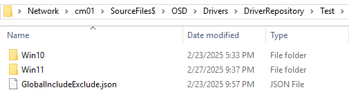

# HP Driver Management

## Getting started
The HPDriverManagement module is used to manage HP drivers and driver repositories. The goal is to take what HP has created with HPCMSL, and wrap around it a framework that makes working with driverpacks, driver repositories, and ConfigMgr packages a little easier.

## Module Configuration
The various cmdlets in the module have required parameters that need values supplied either before running or at runtime, or they will prompt for them. Anytime a cmdlet has to prompt for a parameters value, it breaks any type of automation or cmdlet piping. To help with this, you can take advantage of the PowerShell feature of $PSDefaultParameterValues. $PSDefaultParameterValues can be used to set default values for any PowerShell cmdlet so that they don't need to prompt you. My presence is to set the need variables in your PowerShell profile so they are always available.
Below is an example of what you can put in your PowerShell profile script:

```powershell
$PSDefaultParameterValues["*-DM*:SiteServer"] = "cm01.corp.viamonstra.com"
$PSDefaultParameterValues["*-DM*:SiteCode"] = "PS1"
$PSDefaultParameterValues["*-DM*:CMDBServer"] = "cm01.corp.viamonstra.com"
$PSDefaultParameterValues["*-DM*:HPRepoPath"] = "\\cm01\SourceFiles$\OSD\Drivers\DriverRepository"
$PSDefaultParameterValues["*-DM*:PackageContentPath"] = "\\cm01\SourceFiles$\OSD\Drivers\DriverPacks"
$PSDefaultParameterValues["*-DM*:DistributionPointGroupName"] = "All DPs"
$PSDefaultParameterValues["*-DM*:CMFolder"] = "PS1:\Package\OSD\HP"

$PSDefaultParameterValues["*-DM*:LogFile"] = "C:\ProgramData\Logs\DriverManagement.log"
```

## Driver Packs

### Create a driver pack
```powershell
New-DM_HPDriverPack -Platform AAAA -OS Win11 -OsVer 22H2 -Status Test -Compress
```

Copy a test DriverPack to production.

```powershell
Invoke-DM_HPDriverPackSyncToProd -PlatformID AAAA -OS Win11 -OSBuild 22H2
```

Get prod DriverPack info and use it to create a new DriverPack package

```powershell
Get-DM_HPDriverPack -PlatformID AAAA -OS Win11 -OSBuild 22H2 -Status Prod | New-DM_CMDriverManagementPackage -PackageType DriverPack
```

## Driver Repositories

### Include/Exclude process

The HP driver management module supports the concept of excluding unwanted files from both the repository and the reference image XML file. This is useful if the repository and/or reference image XML file contain a driver or application that you don't want to be installed by Image Assistant. The way this works is there are 2 types of exlude files, Globa, and platform specific.

The Global file sits at the root of the Prod and Test folders. It's read and applied each time a platform model is synced. If you need to make specific include or excludes, you can also do that at the platform level. If something is excluded at the global level and included at the platform level, the platform level wins.

The global file name is GlobalIncludeExclude.json and lives at the root of the test and prod folder. New-DM_HPRepositoryGlobalIncludeExcludeConfig is used to create the file.



The plaform file is named Exclude.json and lives under the .repsoitory folder in the plaform's repository. New-DM_HPRepositoryIncludeExcludeConfig is used to create the file.

When the Invoke-DM_HPRepositorySync command is ran, the cleanup process runs after the sync completes. Anything the was remove is logged into one of two places, the file Exclude.log holds the info of the SP files that were removed from the repo. The XMLExclude.log file holds the info of what applications were removed from the reference image xml. The result is a XML file and repo that no longer contain the unwanted drivers or applications.


It is worth noting that this include/exclude process will run at every sync since the missing files will be re-downloaded.

### Create a new HP Repository

```powershell
New-DM_HPRepository -PlatformID AAAA -OS Win11 -OSBuild 22H2 -Status Test -Category BIOS,Driver,Firmware,OS,Software,UWPPack,Dock
```

### Start the repository sync

When running the sync, you will be presented with WhatIf prompts when the Include/Exclude process begins. Use the -Force parameter to avoid these prompts.

```powershell
Invoke-DM_HPRepositorySync -PlatformID AAAA -OS Win11 -OSBuild 22H2 -Status Test
```

### Do both in one step

When running the sync, you will be presented with WhatIf prompts when the Include/Exclude process begins. Use the -Force parameter to avoid these prompts.

```powershell
New-DM_HPRepository -PlatformID AAAA -OS Win11 -OSBuild 22H2 -Status Test -Category BIOS,Driver,Firmware,OS,Software,UWPPack,Dock | Invoke-DM_HPRepositorySync
```

### Retrieve repository for later use

```powershell
Get-DM_HPRepository -PlatformID AAAA -OS Win11 -OSBuild 22H2 -Status Test
```

### Get repository info and use it to create a new repository package

```powershell
Get-DM_HPRepository -PlatformID AAAA -OS Win11 -OSBuild 22H2 -Status Test | New-DM_CMDriverManagementPackage -PackageType DriverRepository
```

### Create a new repository, sync it, then create a ConfigMgr package in one command

```powershell
New-DM_HPRepository -PlatformID AAA -OS Win11 -OSBuild 22H2 -Status Test -Category All -Force | Invoke-DM_HPRepositorySync -force | New-DM_CMDriverManagementPackage -PackageType DriverRepository -Force
```

### Copy a test driver repository to production

The process simply copies the contents of the test repo to the prod directory. 

```powershell
Invoke-DM_HPRepositorySyncToProd -PlatformID AAAA -OS Win11 -OSBuild 22H2 -Status Test
```

Once copied, you will need to create the ConfigMgr package.

```powershell
New-DM_CMDriverManagementPackage -PlatformID AAAA -OS Win11 -OSBuild 22H2 -Status Prod -PackageType DriverRepository
```

Get prod repository info and use it to create a new repository package in a single command 

```powershell
Get-DM_HPRepository -PlatformID AAAA -OS Win11 -OSBuild 22H2 -Status Prod | New-DM_CMDriverManagementPackage -PackageType DriverRepository
```

### HP Image Assistant Reference Files

The Image Assistant reference files are used to control what is available for Image Assistant to install. When you run Image Assistant after downloading the reference file is pulled directly from HP and has all drivers and utilities available in it. If you want to stop something from installing when running Image Assistant, you need to use a reference file that has been modified to remove the driver or application.

When using the HPDriverManagment module, the modification of the Image Assistant reference files is handled for you. The reference files for each model is stored in its driver repository.
The format for the reference file's name is PlatformID_Architecture_OSVer.OSBuild.xml.

